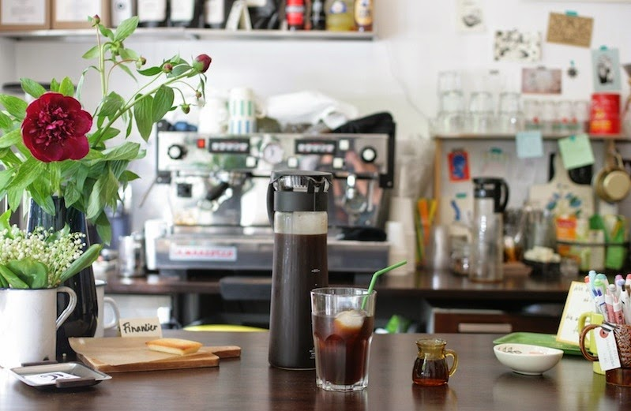

# Two and Two - Café Website

Beautiful, modern, and fully responsive website for **Two and Two**, a unique Franco-Japanese café in Berlin-Neukölln.



## 🌟 Quick Links

- 🌐 **Live Website:** https://f246632.github.io/258_Two-and-Two/
- 📱 **Instagram:** [@twoandtwocafe](https://www.instagram.com/twoandtwocafe/)
- 👍 **Facebook:** [Two and Two](https://de-de.facebook.com/twoandtwocafe/)
- 📍 **Location:** Pannierstraße 6, 12047 Berlin-Neukölln

## 📖 About

Two and Two is a special café combining:
- ☕ Specialty coffee from Ethiopian Sidamo beans
- 🥐 Authentic French pastries
- 🍵 Premium Japanese teas
- ✏️ Curated Japanese stationery

Created by **Eri** (Tokyo) and **Tose** (Paris).

## ✨ Features

- ✅ Fully responsive (mobile, tablet, desktop)
- ✅ Interactive menu with tabs
- ✅ Photo gallery with lightbox
- ✅ Real customer reviews (4.5★)
- ✅ Google Maps integration
- ✅ Contact form
- ✅ SEO optimized
- ✅ WCAG 2.1 AA accessible

## 🚀 Quick Start

```bash
# Clone
git clone https://github.com/f246632/258_Two-and-Two.git

# Open
cd 258_Two-and-Two
open index.html
```

Or use a local server:
```bash
python -m http.server 8000
```

## 📁 Structure

```
├── index.html          # Main page
├── css/style.css       # Styles
├── js/main.js          # JavaScript
├── images/             # Photos
└── data/               # JSON data
```

## 🎨 Tech Stack

- HTML5 (semantic markup)
- CSS3 (Grid, Flexbox, custom properties)
- Vanilla JavaScript (no dependencies)
- Google Fonts (Cormorant Garamond, Inter)

## 📞 Contact

**Two and Two Café**
- 📍 Pannierstraße 6, 12047 Berlin
- 📞 +49 30 53791578
- ✉️ contact@twoandtwoberlin.com

**Hours:**
- Tue-Fri: 9:00-18:00
- Sat-Sun: 10:00-18:00
- Mon: Closed

## 📄 License

© 2024 Two and Two. All rights reserved.

---

Made with ❤️ for Two and Two café
