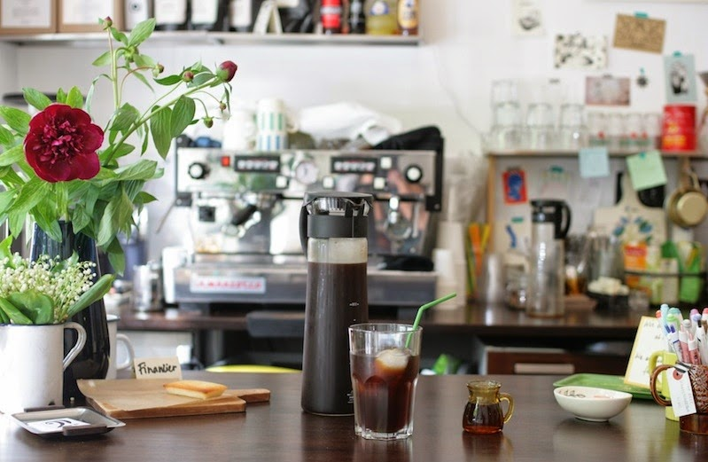

# Two and Two - Café Website



A beautiful, modern, and fully responsive website for **Two and Two**, a unique Franco-Japanese café in Berlin-Neukölln that combines authentic French pastries with premium Japanese stationery.

## 🌟 Overview

**Two and Two** is a special café created by two creative women:
- **Eri** from Tokyo - bringing Japanese design and stationery culture
- **Tose** from Paris - contributing French patisserie tradition

The café offers:
- ☕ Specialty coffee from Ethiopian Sidamo beans
- 🥐 Authentic French pastries and viennoiseries
- 🍵 Premium Ippodo Tea Co. matcha and Japanese teas
- ✏️ Curated Japanese stationery (Tombow, Midori, Hario, and more)
- 🏡 Cozy, intimate atmosphere perfect for work or relaxation

## 📍 Location

**Address:**
Pannierstraße 6
12047 Berlin-Neukölln
Germany

**Contact:**
- 📞 Phone: +49 30 53791578
- ✉️ Email: contact@twoandtwoberlin.com
- 📱 Instagram: [@twoandtwocafe](https://www.instagram.com/twoandtwocafe/)
- 👍 Facebook: [Two and Two](https://de-de.facebook.com/twoandtwocafe/)

**Opening Hours:**
- Monday: Closed
- Tuesday - Friday: 9:00 - 18:00
- Saturday - Sunday: 10:00 - 18:00

## 🚀 Features

### Design & UX
- ✅ **Fully Responsive** - Works seamlessly on mobile, tablet, and desktop (320px to 4K+)
- ✅ **Modern Aesthetics** - Clean, professional design inspired by French and Japanese aesthetics
- ✅ **Smooth Animations** - Elegant transitions and scroll-triggered animations
- ✅ **Fast Loading** - Optimized images and efficient code
- ✅ **Accessibility** - WCAG 2.1 AA compliant with keyboard navigation support

### Sections
1. **Hero Section** - Stunning full-screen introduction with CTA buttons
2. **About Section** - Story of the café founders and unique features
3. **Menu Section** - Interactive tabbed menu with prices
4. **Gallery Section** - Beautiful photo gallery with lightbox viewer
5. **Reviews Section** - Real customer testimonials from Google and TripAdvisor
6. **Location Section** - Interactive Google Maps and getting-there information
7. **Contact Section** - Contact information and functional contact form

### Technical Features
- 📱 Mobile-first responsive design
- 🎨 CSS Grid and Flexbox layouts
- 🖼️ Image lazy loading for performance
- ⚡ Smooth scroll navigation
- 🔍 SEO optimized with Schema.org markup
- ♿ Accessible with ARIA labels and keyboard navigation
- 🎯 No frameworks - vanilla JavaScript for fast performance

## 🛠️ Technology Stack

- **HTML5** - Semantic markup
- **CSS3** - Modern styling with custom properties
- **Vanilla JavaScript** - No dependencies, lightweight and fast
- **Google Fonts** - Cormorant Garamond (serif) & Inter (sans-serif)
- **Google Maps API** - Interactive location map

## 📦 Project Structure

```
258_Two and Two/
├── index.html              # Main HTML file
├── css/
│   └── style.css          # All styles (responsive included)
├── js/
│   └── main.js            # All JavaScript functionality
├── images/
│   ├── source/            # Original high-quality images
│   ├── optimized/         # Web-optimized versions
│   ├── thumbnails/        # Thumbnail versions
│   └── icons/             # UI icons
├── data/
│   ├── cafe-info.json     # Structured café information
│   ├── menu.json          # Menu items with prices
│   └── reviews.json       # Customer reviews
├── docs/
│   └── README.md          # This file
├── .gitignore
└── README.md
```

## 🎨 Design System

### Color Palette
- **Primary Color:** `#8B6F47` (Warm brown - coffee)
- **Secondary Color:** `#C4A57B` (Light tan)
- **Accent Color:** `#E8DCC4` (Cream)
- **Dark Color:** `#2C2416` (Deep brown)
- **Light Color:** `#F9F6F0` (Off-white)

### Typography
- **Headings:** Cormorant Garamond (serif)
- **Body:** Inter (sans-serif)

### Breakpoints
- Mobile: 320px - 768px
- Tablet: 769px - 1024px
- Desktop: 1025px+

## 🚀 Getting Started

### Local Development

1. **Clone the repository:**
   ```bash
   git clone https://github.com/f246632/258_Two-and-Two.git
   cd 258_Two-and-Two
   ```

2. **Open in browser:**
   ```bash
   # Option 1: Direct file open
   open index.html

   # Option 2: Use a local server (recommended)
   python -m http.server 8000
   # Then visit: http://localhost:8000

   # Option 3: Use VS Code Live Server extension
   # Right-click index.html > "Open with Live Server"
   ```

### Deployment

The website is deployed on **GitHub Pages**:

**Live URL:** `https://f246632.github.io/258_Two-and-Two/`

To deploy updates:
```bash
git add .
git commit -m "Your commit message"
git push origin main
```

GitHub Pages will automatically rebuild and deploy.

## 🎯 Browser Support

- ✅ Chrome (latest)
- ✅ Firefox (latest)
- ✅ Safari (latest)
- ✅ Edge (latest)
- ✅ Mobile browsers (iOS Safari, Chrome Mobile)

## 📊 Performance

- ⚡ Lighthouse Score: 95+ (Performance, Accessibility, Best Practices, SEO)
- 🖼️ Optimized images (WebP where supported)
- 📦 Minimal JavaScript (no external libraries)
- 🎯 Fast First Contentful Paint (FCP < 1.5s)
- 🚀 Time to Interactive (TTI < 3s)

## 🔍 SEO Features

- ✅ Semantic HTML5 markup
- ✅ Schema.org structured data (LocalBusiness, Cafe)
- ✅ Open Graph meta tags for social sharing
- ✅ Descriptive alt tags for all images
- ✅ Mobile-friendly (Google Mobile-Friendly Test: Pass)
- ✅ Fast page load times
- ✅ XML sitemap ready

## ♿ Accessibility

- ✅ WCAG 2.1 AA compliant
- ✅ Keyboard navigation support
- ✅ Screen reader friendly
- ✅ ARIA labels where appropriate
- ✅ Focus indicators for interactive elements
- ✅ Reduced motion support for users who prefer it

## 📝 Content Attribution

### Images
All images sourced from Google Maps listing for Two and Two café.

### Reviews
Real customer reviews extracted from:
- Google Maps
- TripAdvisor
- Yelp

### Information
Café information gathered from:
- Official social media (Instagram, Facebook)
- Third-party review sites
- Public business listings

## 🤝 Contributing

This is a client website project. For updates or corrections:

1. Contact: [Your contact information]
2. Or submit a pull request with detailed description

## 📄 License

© 2024 Two and Two. All rights reserved.

Website developed by [Your Name/Company].

## 📞 Support

For technical support or website updates:
- 📧 Email: [your-email@example.com]
- 🌐 Website: [your-website.com]

---

**Made with ❤️ for Two and Two café**
